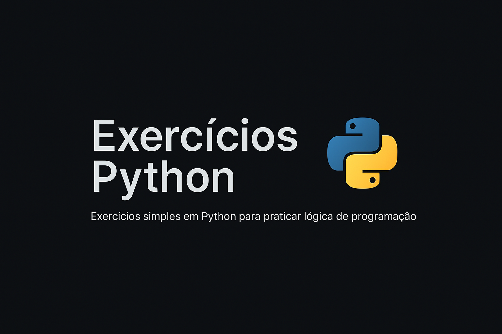

# Exercícios Python 🐍

Repositório com exercícios simples desenvolvidos durante meu aprendizado no curso de Python.

---

## Exercícios disponíveis

- ex01 → Variáveis e tipos primitivos
- ex02 → Cálculo IMC
- ex03 → Comparação de Valores
- ex04 → Manipulação de Strings
- ex05 → Verificação de Horário
- ex06 → Classificação de Nome (curto, normal, grande)
- ex07 → Verificação de número par ou ímpar

---

## Contato

Feito com 💙 por [Henrique Fonseca](https://github.com/heenriquefonseca)  
[LinkedIn](https://www.linkedin.com/in/heenriquefonseca/)
